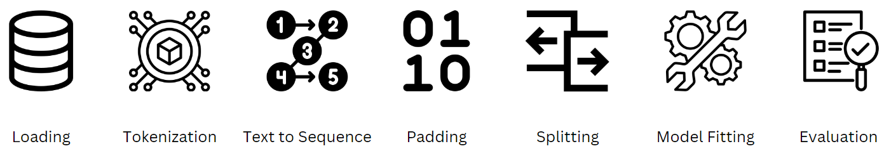

# NLP Techniques for Text Classification: Spam or Ham



## Introduction
This repository contains a Python notebook that demonstrates the use of Recurrent Neural Networks (RNN) and Long Short-Term Memory (LSTM) models for classifying emails as spam or non-spam (ham). The notebook compares use of drop-out and recurrent drop-out layers to improve model performance and reduce overfitting.

## Techniques Deployed
- Tokenization and Padding Sequences
- RNN and LSTM Model Development
- Dropout and Recurrent Dropout Regularization
- TensorFlow and Keras

## Getting Started
1. Clone this repository.
   ```sh
   git clone https://github.com/ian-cokehyeng/NLP_TextClassification.git
   ```
2. Install the required libraries.
   ```sh
   pip install -r requirements.txt
   ```
3. Run the notebook.
   ```sh
   jupyter notebook RNN_and_LSTM_Classification.ipynb
   ```

## Dataset
The dataset used in this project is sourced from [Kaggle](https://www.kaggle.com/datasets/prishasawhney/email-classification-ham-spam). It contains two columns:
- `Email`: The textual content of the email.
- `Label`: The classification label (spam or ham).